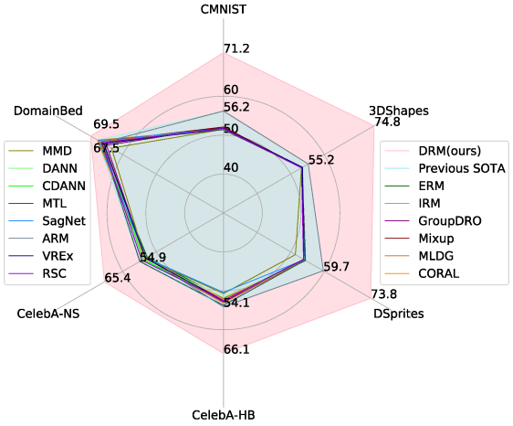
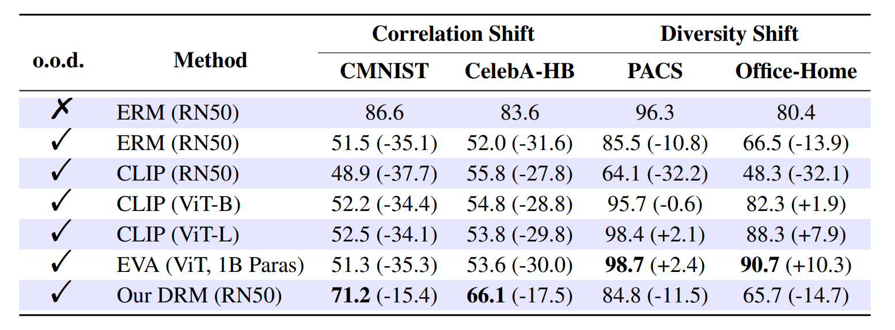

# DIRECT-EFFECT RISK MINIMIZATION

This repository is the implementation of [Direct-Effect Risk Minimization for Domain Generalization](https://arxiv.org/abs/2211.14594). DRM consists of two stages: learning an indirect-effect representation in *stage 1* and removing the indirect effects in *stage 2*.


## Main Results
<div align=center>

</div>

Test accuracy of o.o.d. algorithms on 5 correlation-shifted datasets and the DomainBed benchmark (avg). The pink region represents the performance of our method, while the light blue region represents the previously best-known results (implemented by [DomainBed](https://github.com/facebookresearch/DomainBed/) using training-domain validation) on each dataset.


Min and Avg are the minimum value and the average of accuracy for all test environments, respectively.


Our approach is based only on an improvement of the sampling phase, so both training set balancing (TB) and validation set balancing (VB) can be easily combined with other algorithms. Both training set balancing and validation set balancing can improve the o.o.d. performance of the original model significantly.

<div align=center>

</div>

Large-scale models pre-trained with large-scale data can generalize well on diversity-shifted datasets, but show little improvement on correlation-shifted datasets. Experimental results on DomainBed, which show that DRM will not hurt the model performance on the diversity-shifted dataset. [CLIP](https://github.com/openai/CLIP) (ViT-L) and [EVA](https://github.com/baaivision/EVA) (ViT, 1B parameters) in the o.o.d. case even outperforms ResNet-50 in the i.i.d. case on PACS and Office-Home, suggesting that the diversity shift problem can be alleviated by increasing the scale of training data and parameters, as well as improving the model architecture. 


Experimental results on DomainBed, which show that DRM will not hurt the model performance on the diversity-shifted dataset.

## Available datasets

The [currently available datasets](https://github.com/facebookresearch/DomainBed/blob/main/domainbed/datasets.py) are:

- RotatedMNIST ([Ghifary et al., 2015](https://arxiv.org/abs/1508.07680))
- ColoredMNIST ([Arjovsky et al., 2019](https://arxiv.org/abs/1907.02893))
- VLCS ([Fang et al., 2013](https://openaccess.thecvf.com/content_iccv_2013/papers/Fang_Unbiased_Metric_Learning_2013_ICCV_paper.pdf))
- PACS ([Li et al., 2017](https://arxiv.org/abs/1710.03077))
- Office-Home ([Venkateswara et al., 2017](https://arxiv.org/abs/1706.07522))
- A TerraIncognita ([Beery et al., 2018](https://arxiv.org/abs/1807.04975)) subset
- DomainNet ([Peng et al., 2019](http://ai.bu.edu/M3SDA/))
- CelebA ([Liu et al., 2019](https://openaccess.thecvf.com/content_iccv_2015/html/Liu_Deep_Learning_Face_ICCV_2015_paper.html))
- 3dshapes([Burgess et al., 2018](https://github.com/deepmind/3d-shapes))
- DSprites([Matthey et al., 2017](https://github.com/deepmind/dsprites-dataset/))

## Preparation

```sh
conda env create -f drm.yaml
```

## Training

The code structure of [ ./stage1](./stage1) and [./stage2 ](./stage2 )is similar to [DomainBed](https://github.com/facebookresearch/DomainBed/). Script [./stage1(2)/domainbed/scripts/train.py](./stage1/domainbed/scripts/train.py) trains a single model. Script [./stage1(2)/domainbed/scripts/sweep.py](./stage1/domainbed/scripts/sweep.py) searches hyperparameters.  Script [./stage1/listresult.py](./stage1/listresult.py) is used to select the best model trained in stage1.

### stage1

```sh
python -m domainbed.scripts.sweep launch\
       --data_dir=/my/datasets/path\
       --output_dir=/my/sweep/output/path\
       --command_launcher=MyLauncher\
       --datasets=XX
```

The parameter 'datasets' can be ColoredMNIST, CelebA, DSprites, dshapes, RotatedMNIST, VLCS, PACS, OfficeHome, TerraIncognita, and DomainNet, parameter 'output_dir' is the path to save the models and results.

### select the best model trained in stage 1

```sh
python listresult --in_dir=/my/sweep/output/path\
                  --out_dir=stage2/weights
```

The parameter 'in_dir' should be consistent with 'output_dir' in stage1 parameter '--out_dir' is the path to copy the best model.

### stage2

```sh
python -m domainbed.scripts.sweep launch\
       --algorithms=ERM\
       --data_dir=/my/datasets/path\
       --output_dir=/my/sweep/output/path\
       --command_launcher MyLauncher
       --datasets=XX
```

DRM can be used in conjunction with different methods and now supports ERM ([Vapnik, 1998](https://www.wiley.com/en-fr/Statistical+Learning+Theory-p-9780471030034)), IRM ([Arjovsky et al., 2019](https://arxiv.org/abs/1907.02893)), and CORAL ([Sun and Saenko, 2016](https://arxiv.org/abs/1607.01719)).

