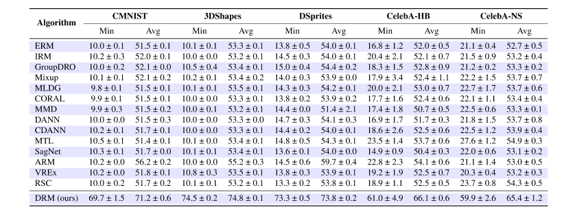

# DIRECT-EFFECT RISK MINIMIZATION

This repository is the implementation of [Direct-Effect Risk Minimization for Domain Generalization](URL). DRM consists of two stages: learning an indirect-effect representation in *stage 1* and removing the indirect effects in *stage 2*.


## Main Results


Test accuracy of o.o.d. algorithms on 5 correlation-shifted datasets and the DomainBed benchmark (avg). The pink region represents the performance of our method, while the light blue region represents the previously best-known results (implemented by [DomainBed](https://github.com/facebookresearch/DomainBed/) using training-domain validation) on each dataset.




Min and Avg are the minimum value and the average of accuracy for all test environments, respectively.

## Training

The code structure of [ ./stage1](./stage1) and [./stage2 ](./stage2 )is similar to [DomainBed](https://github.com/facebookresearch/DomainBed/). Scripts [./stage1/domainbed/scripts/train.py](./stage1/domainbed/scripts/train.py) and [./stage2/domainbed/scripts/train.py](./stage2/domainbed/scripts/train.py) are used to train a single model. Scripts [./stage1/domainbed/scripts/sweep.py](./stage1/domainbed/scripts/sweep.py) and [./stage2/domainbed/scripts/sweep.py](./stage2/domainbed/scripts/sweep.py) are used to search hyperparameters.  Script [./stage1listresult.py](./stage1listresult.py) is used to select the best model trained in stage 1.

### stage1

```sh
python -m domainbed.scripts.sweep launch\
       --data_dir=/my/datasets/path\
       --output_dir=/my/sweep/output/path\
       --command_launcher=MyLauncher\
       --datasets=XX
```

The parameter 'datasets' can be ColoredMNIST, CelebA, DSprites, dshapes, RotatedMNIST, VLCS, PACS, OfficeHome, TerraIncognita, and DomainNet, parameter 'output_dir' is the path to save the models and results.

### select the best model trained in stage 1

```sh
python listresult --in_dir=/my/sweep/output/path\
                  --out_dir=stage2/weights
```

The parameter 'in_dir' should be consistent with 'output_dir' in stage1 and parameter '--out_dir' is the path to copy the best model.

### stage2

```sh
python -m domainbed.scripts.sweep launch\
       --algorithms=ERM\
       --data_dir=/my/datasets/path\
       --output_dir=/my/sweep/output/path\
       --command_launcher MyLauncher
       --datasets=XX
```

DRM can be used in conjunction with different methods and now supports ERM, IRM, and CORAL.
